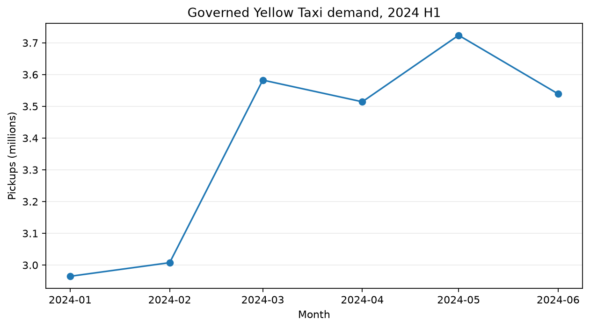
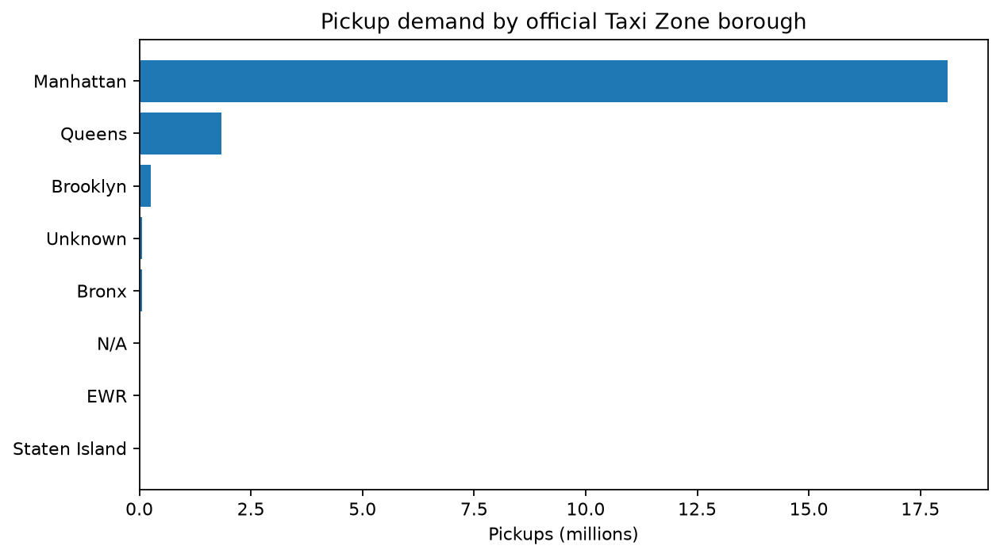
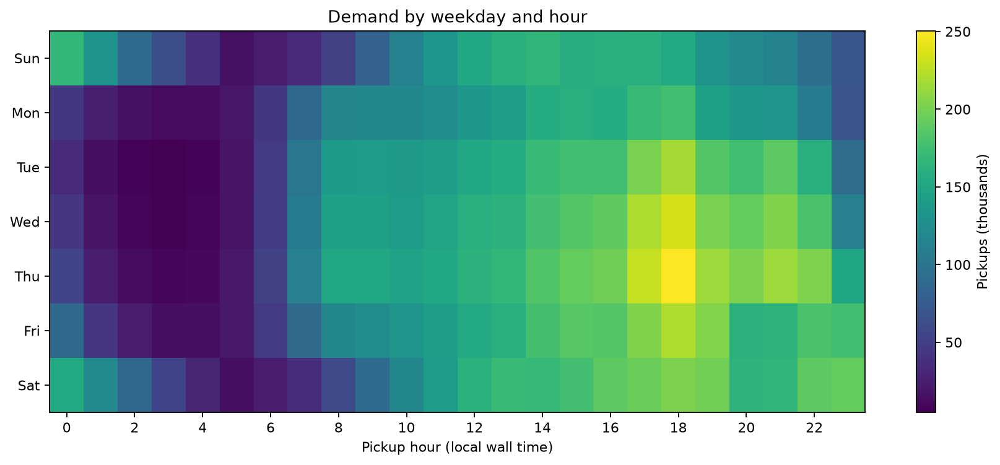
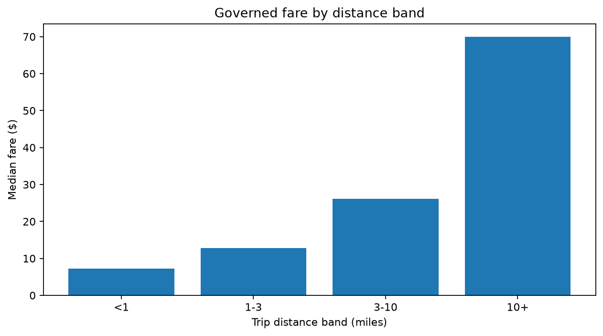
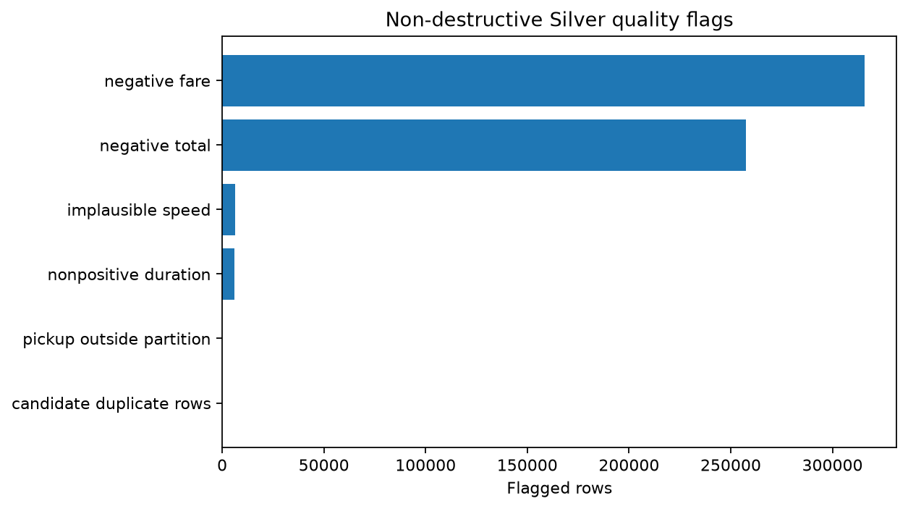

# Governed EDA: NYC Yellow Taxi, 2024 H1

## Scope and trust boundary

This analysis covers January through June 2024. It reads the governed Gold hourly-zone demand product and the exact six Silver partitions recorded in the Gold lineage manifest. Checksums are verified before analysis, so later 2025–2026 partitions in the data lake cannot silently contaminate these results.

Demand metrics use the Gold eligibility rule. Fare, distance, duration, and payment summaries use `dq_valid_for_fare`. Silver quality flags remain non-destructive: suspicious rows are measured and retained rather than silently deleted.

## Demand



- Total eligible pickups: **20,331,944**.
- Monthly demand rose from 2.96 million in January to a peak of **3.72 million in May**, then eased to 3.54 million in June.
- Manhattan accounted for **18.11 million (89.1%)** of eligible pickups. Queens contributed 1.83 million (9.0%). This is pickup activity, not total city travel demand, and reflects the Yellow Taxi operating footprint.



The leading pickup zones were Midtown Center (954,875), Upper East Side South (947,082), JFK Airport (916,774), Upper East Side North (879,901), and Midtown East (701,956). Airport and central-Manhattan demand therefore dominate the top of the distribution.

JFK and LaGuardia together account for **1,555,533 pickups (7.7%)**. Average eligible pickups per calendar day are 112,599 on weekdays and 109,501 on weekends; using per-day rates avoids comparing five weekdays with two weekend days.

## Time pattern



Demand is concentrated in weekday late afternoons and evenings. The largest weekday-hour cell is **Thursday at 18:00**, with 250,454 eligible pickups across the six-month period. Wednesday 18:00 and Thursday 17:00 follow. These are aggregate calendar patterns, not causal effects or forecasts.

## Fare-eligible trip distribution

The governed fare sample contains **20,009,098 rows**. Median fare is $13.50 versus a mean of $19.46; the 95th percentile is $62.73. Median trip distance is 1.76 miles and median duration is 12.6 minutes. The large mean–median gap indicates a right-skewed mixture of short urban trips and longer, often airport-related trips.



These figures describe records passing the fare product rule; they should not be read as a complete measure of passenger expenditure without adding taxes, surcharges, tolls, and tips according to the intended business definition.

## Data quality findings



Across the six governed partitions, quality checks flagged 315,747 negative fares, 257,431 negative totals, 6,266 implausible speeds, 6,177 non-positive durations, 149 pickups outside their declared month, and 2 candidate duplicate rows. Flags can overlap, so their counts must not be added as if they were distinct rejected trips.

Negative monetary values are the main quality issue and may include reversals or corrections, not only bad data. They are excluded from fare-oriented summaries but remain available in Silver for audit and alternative business rules.

## Reproduce

```powershell
python -m src.nyc_taxi.eda
```

The command regenerates the charts, compact CSV result tables, and `summary.json` in `docs/assets/eda`. Input scope comes from `data/processed/lineage/hourly_zone_demand.json`, not from a wildcard over the whole lake.

## Interpretation limits

- The dataset contains Yellow Taxi trips, not Uber or the complete Sydney/NYC mobility market.
- Pickup geography is joined to the official TLC Taxi Zone lookup; unknown or unmapped zones are retained explicitly.
- Time is local wall-clock time from the source timestamps. Daylight-saving ambiguity should be addressed before minute-level causal or operational modeling.
- EDA reveals associations and data behavior. It does not by itself establish causality or out-of-sample forecast performance.
